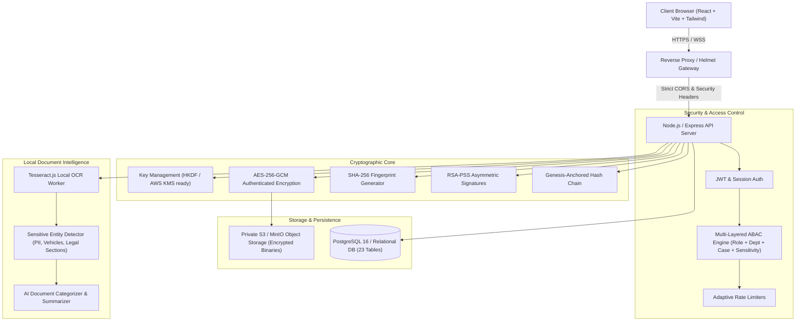

# SECUREVAULT Architecture Reference

## 1. System Overview

**SecureVault** is an enterprise-grade digital document and investigation evidence platform designed for legal departments, law enforcement agencies, cyber forensics units, and judicial bodies.

The platform unifies five foundational pillars:
- **CONFIDENTIALITY**: AES-256-GCM authenticated envelope encryption with per-document HKDF key derivation.
- **INTEGRITY**: Cryptographic SHA-256 fingerprinting with real-time bitrot and tampering detection.
- **ACCOUNTABILITY**: Tamper-evident hash-chained audit ledger rooted in a deterministic Genesis block.
- **TRACEABILITY**: Verifiable digital evidence chain of custody tracking physical and electronic handovers.
- **INTELLIGENCE**: Local privacy-preserving OCR, classification, and sensitive entity extraction.

---

## 2. End-to-End System Architecture



---

## 3. Cryptographic Pipeline Specification

### 3.1 AES-256-GCM Authenticated Encryption
Each confidential document is encrypted using authenticated encryption with associated data (AEAD):
- **Master Key**: 256-bit entropy stored in secure environment or AWS KMS.
- **Envelope Key Derivation**: Unique 256-bit document key derived via HKDF-SHA256:
  $$\text{Key}_{\text{doc}} = \text{HKDF}(\text{MasterKey}, \text{salt}=\text{"SecureVault-Salt-v1"}, \text{info}=\text{"doc:"} + \text{DocID}, \text{length}=32)$$
- **Initialization Vector (IV)**: 96-bit (12 bytes) cryptographically secure pseudorandom number generated per encryption via `crypto.randomBytes(12)`.
- **Authentication Tag**: 128-bit (16 bytes) tag computed by GCM. Any bit flip or modification in ciphertext triggers immediate authentication rejection upon decryption.
- **Encrypted Payload Container**:
  $$\text{Payload} = [\text{IV}_{12\text{B}} \parallel \text{AuthTag}_{16\text{B}} \parallel \text{Ciphertext}_{N\text{B}}]$$

### 3.2 Genesis-Anchored Hash-Chained Audit Ledger
Every system and governance event is cryptographically linked to its predecessor:
$$\text{CurrentHash} = \text{SHA256}(\text{PrevHash} \parallel \text{EventID} \parallel \text{UserID} \parallel \text{Action} \parallel \text{ResourceID} \parallel \text{CaseID} \parallel \text{Timestamp} \parallel \text{Details})$$

- **Genesis Anchor**: Block 0 uses $\text{PrevHash} = 0^{64}$ (64 zeros).
- **Verification**: Verifier iterates sequentially from Genesis to the latest block, recalculating expected hashes. Any alteration of past records causes immediate chain collapse:
  $$\text{StoredHash} \neq \text{RecalculatedHash} \implies \text{🚨 AUDIT CHAIN INTEGRITY FAILED}$$

### 3.3 Asymmetric Digital Signatures
- **Algorithm**: RSA-PSS with SHA-256 digest and 32-byte salt length.
- **Root Authority**: SecureVault Trust Services PKI.
- **Status Attestation**:
  - `VALID`: Signature matches public key and current document SHA-256.
  - `DOCUMENT_MODIFIED_AFTER_SIGNING`: Content was altered post-signing.
  - `INVALID`: Signature payload corrupt or mismatched.

---

## 4. Multi-Layered ABAC Clearance Matrix

Every request to access, view, or download documents is evaluated against 7 independent layers:
1. **User Identity & State**: Account active, unexpired session, failed login count $< 5$.
2. **Role Hierarchy**:
   - `ADMINISTRATOR`: Full governance, user provisioning, case assignment.
   - `INVESTIGATOR`: Active cases, assigned evidence, JIT access requests.
   - `AUDITOR`: Read-only governance, audit verification, security event review.
3. **Department Isolation**: Division clearance (Cyber Crime, Investigation, Legal, Forensics).
4. **Case Membership**: Explicit assignment in `case_members` table.
5. **Document Clearance**:
   - `UNRESTRICTED`: Open to department personnel.
   - `CONFIDENTIAL`: Restricted to assigned case investigators.
   - `SECRET`: Requires case lead or explicit permission.
   - `TOP_SECRET`: Requires administrative grant or approved JIT request.
6. **Just-In-Time (JIT) Temporary Grants**: Time-bound access automatically revoked upon expiration.
7. **Document Lifecycle State**: Soft-deleted or archived items require administrative restoration.

---

## 5. Non-Destructive Watermarking Engine
When an authorized investigator views or downloads sensitive evidence, a dynamic watermark overlay is rendered on the fly:
```
CONFIDENTIAL - SECUREVAULT EVIDENCE
USER: Senior Investigator Sharma (SV-INV-104)
DOC: doc_fir_104 | 2026-09-08 18:30:00 UTC
```
The master ciphertext stored in AWS S3 or MinIO is **never modified**, guaranteeing that original evidentiary integrity hashes remain pristine.
