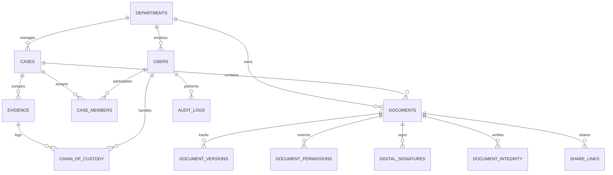

# SECUREVAULT Relational Database Reference

SecureVault implements 23 relational tables supporting standard ANSI SQL across PostgreSQL 16 (production) and embedded relational engines.

## 1. Table Catalog

| Table | Primary Key | Purpose |
| :--- | :--- | :--- |
| `departments` | `id (TEXT)` | Organizational isolation divisions (Cyber Crime, Legal, Forensics, etc.) |
| `roles` | `id (TEXT)` | Security roles (`ADMINISTRATOR`, `INVESTIGATOR`, `AUDITOR`) |
| `permissions` | `id (TEXT)` | Atomic authorization permission codes |
| `users` | `id (TEXT)` | Officer credentials, hashed passwords, clearance, and lockout tracking |
| `user_roles` | `(user_id, role_id)` | M:N user-role mappings |
| `cases` | `id (TEXT)` | Case dockets (`CASE-2026-104`, sensitivity, status) |
| `case_members` | `id (TEXT)` | Case investigator assignments and case lead roles |
| `documents` | `id (TEXT)` | Metadata, AES-GCM storage key, SHA-256 hash, AI classification, OCR text |
| `document_versions` | `id (TEXT)` | Version control records with per-version hash and author |
| `document_permissions` | `id (TEXT)` | Explicit granular grants (`READ`, `WRITE`, `DOWNLOAD`) |
| `tags` | `id (TEXT)` | Normalized searchable tags |
| `document_tags` | `(document_id, tag_id)` | M:N document-tag associations |
| `evidence` | `id (TEXT)` | Forensic evidence records (`EV-2026-104-A`, status, locker location) |
| `chain_of_custody` | `id (TEXT)` | Transfer events, previous/new custodian, reasons, integrity hashes |
| `digital_signatures` | `id (TEXT)` | Asymmetric RSA-PSS signatures, public key fingerprints, timestamps |
| `audit_logs` | `id (TEXT)` | Indelible event log with previous block hash and current hash |
| `audit_chain` | `id = 1` | Singleton ledger state record tracking head block and total block count |
| `security_alerts` | `id (TEXT)` | Incident alerts, explainable reasons, severity (`LOW` to `CRITICAL`) |
| `notifications` | `id (TEXT)` | Officer notifications for security events and JIT requests |
| `share_links` | `id (TEXT)` | 192-bit high-entropy share tokens, bcrypt passwords, expiration |
| `document_integrity` | `id (TEXT)` | Periodic and on-demand verification logs (`VERIFIED` vs `COMPROMISED`) |
| `access_requests` | `id (TEXT)` | JIT temporary clearance requests, requested durations, approval status |
| `retention_policies` | `id (TEXT)` | Archival and disposal governance policies per department and sensitivity |

---

## 2. Entity Relationship Diagram

